# 🎤 TTS 语音合成 Agent 执行流程图

> 本文档描述 TTS Agent 的完整执行流程、架构设计和组件交互关系。

---

## 一、系统架构总览

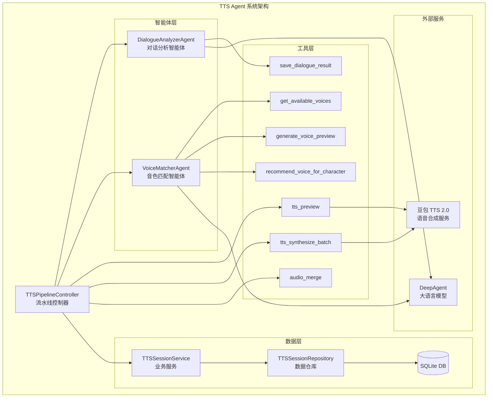

---

## 二、三阶段流水线执行流程

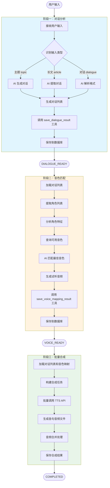

---

## 三、会话状态流转图

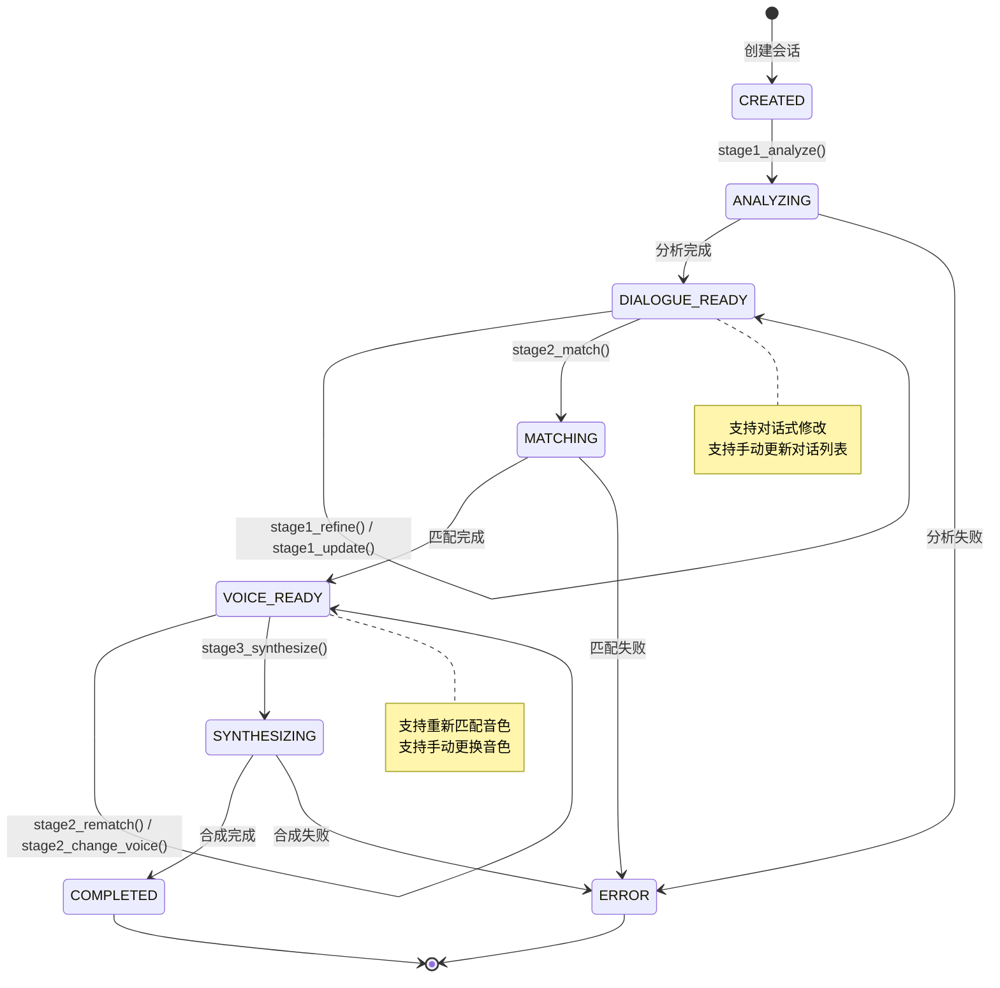

---

## 四、核心组件交互时序图

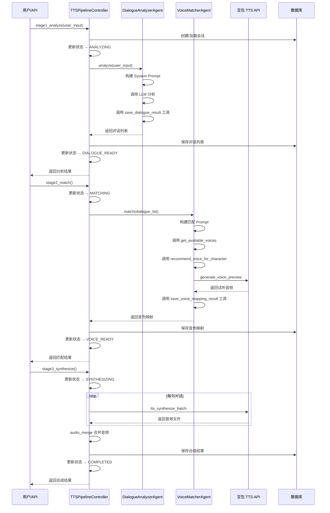

---

## 五、数据模型关系图

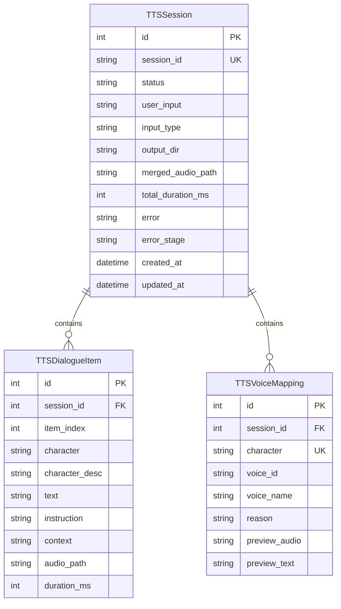

---

## 六、DialogueAnalyzerAgent 内部流程

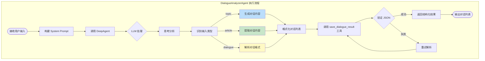

---

## 七、VoiceMatcherAgent 内部流程

```mermaid
flowchart TD
    subgraph "VoiceMatcherAgent 执行流程"
        Start([接收对话列表]) --> Extract[提取角色列表]
        Extract --> Analyze[分析角色特征]
        
        Analyze --> Query[查询可用音色库]
        Query --> Tools1[get_available_voices]
        Query --> Tools2[recommend_voice_for_character]
        
        Tools1 --> Match[AI 匹配决策]
        Tools2 --> Match
        
        Match --> Preview[生成试听音频]
        Preview --> Tools3[generate_voice_preview]
        Tools3 --> TTS[调用 TTS API]
        TTS --> Audio[获取音频文件]
        
        Audio --> Build[构建音色映射]
        Build --> Tool[调用 save_voice_mapping_result 工具]
        Tool --> Validate{验证结果}
        
        Validate -->|成功| Return[返回音色映射]
        Validate -->|失败| Retry[重试]
        Retry --> Match
        
        Return --> End([输出音色映射])
    end

    style Match fill:#ffccbc
    style Preview fill:#d1c4e9
```

---

## 八、工具调用关系图

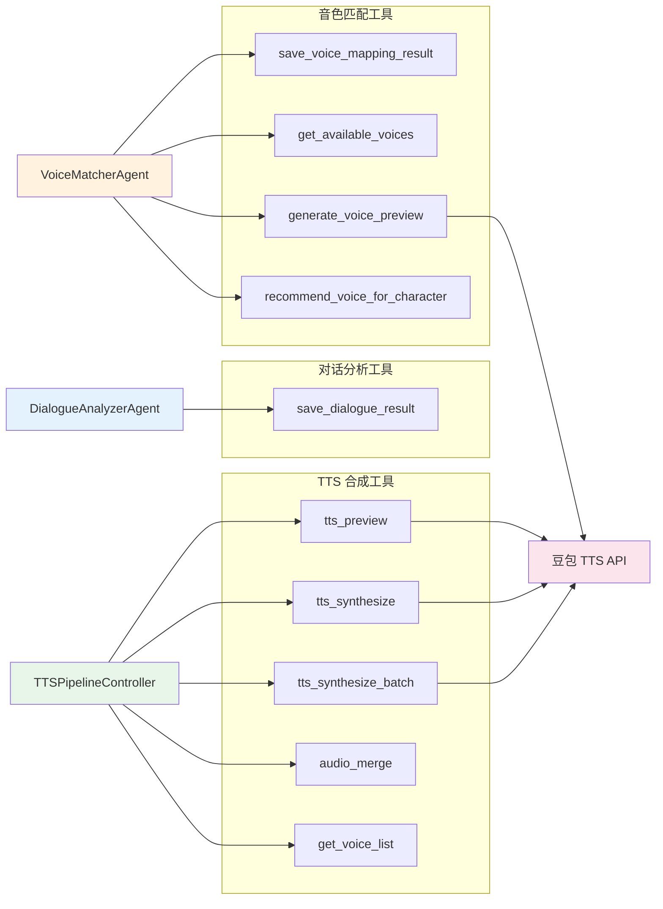

---

## 九、使用方式

### 方式一：使用流水线控制器（推荐）

```python
from agents.tts_agent import create_tts_pipeline

pipeline = create_tts_pipeline()

# 阶段一：分析输入
result = await pipeline.stage1_analyze("职场面试")
print(result["dialogue_list"])

# 阶段二：匹配音色
result = await pipeline.stage2_match()
print(result["voice_mapping"])

# 阶段三：批量合成
result = await pipeline.stage3_synthesize()
print(result["merged_audio"])
```

### 方式二：直接使用 Agent

```python
from agents.tts_agent import DialogueAnalyzerAgent, VoiceMatcherAgent

# 对话分析
analyzer = DialogueAnalyzerAgent()
result = await analyzer.analyze("恋人分手")

# 音色匹配
matcher = VoiceMatcherAgent()
result = await matcher.match(dialogue_list)
```

### 方式三：命令行使用

```bash
# 交互模式
python -m agents.tts_agent -i

# 单次分析
python -m agents.tts_agent -q "职场面试"

# 完整流水线
python -m agents.tts_agent --pipeline "职场面试"

# 查看音色列表
python -m agents.tts_agent --voices
```

---

## 十、文件结构

```
agents/tts_agent/
├── __init__.py              # 模块入口，导出所有组件
├── __main__.py              # 命令行入口
├── controller.py            # TTSPipelineController 流水线控制器
├── dialogue_analyzer.py     # DialogueAnalyzerAgent 对话分析智能体
├── voice_matcher.py         # VoiceMatcherAgent 音色匹配智能体
├── models.py                # 数据模型定义
├── prompts.py               # 提示词模板
├── templates.py            # 音色模板和辅助函数
├── tools.py                 # TTS 工具函数
├── db_service.py            # 业务逻辑服务层
└── session_repository.py    # 数据库 CRUD 仓库
```

---

## 十一、豆包 TTS 2.0 服务执行流程

### 11.1 服务架构总览

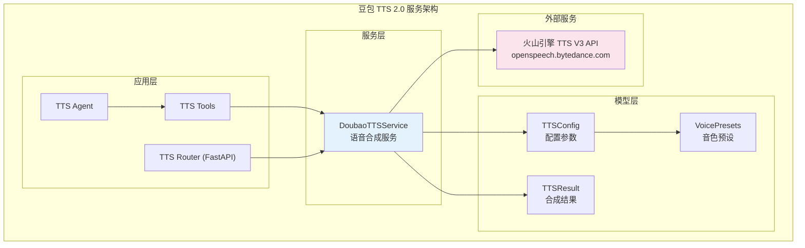

---

### 11.2 同步合成流程详解

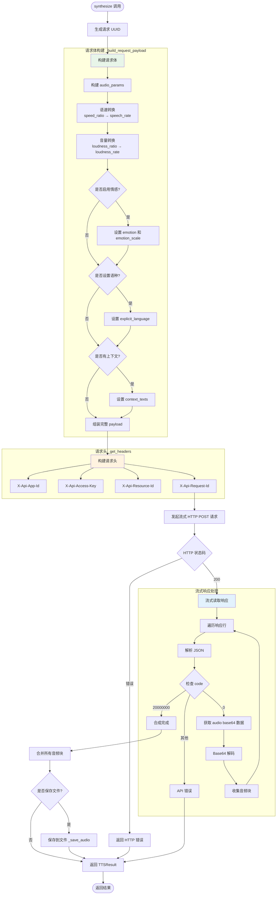

---

### 11.3 请求体结构

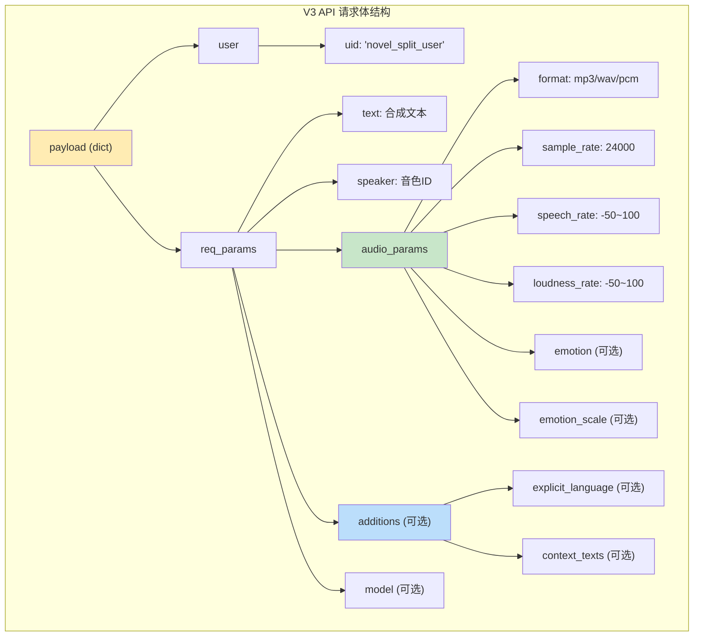

---

### 11.4 资源 ID 与音色类型映射

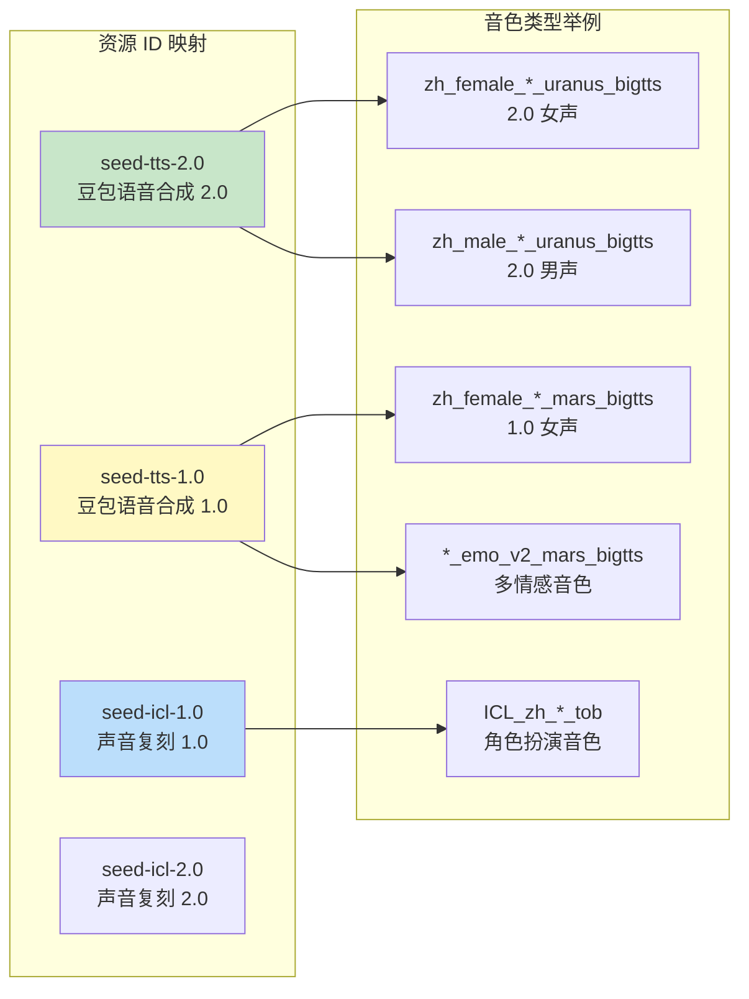

---

### 11.5 错误处理流程

```mermaid
flowchart TD
    Request([发起请求]) --> Timeout{超时?}
    Timeout -->|是| TimeoutErr[返回超时错误]
    Timeout -->|否| HttpCheck{HTTP 状态}
    
    HttpCheck -->|非200| HttpErr[返回 HTTP 错误<br/>包含状态码和错误信息]
    HttpCheck -->|200| ParseResp[解析响应]
    
    ParseResp --> JsonCheck{JSON 解析}
    JsonCheck -->|失败| JsonWarn[记录警告<br/>继续处理]
    JsonCheck -->|成功| CodeCheck{检查 code}
    
    CodeCheck -->|0| Success[正常数据]
    CodeCheck -->|20000000| Complete[合成完成]
    CodeCheck -->|其他| ApiErr[返回 API 错误<br/>包含 code 和 message]
    
    Success --> Continue[继续收集数据]
    JsonWarn --> Continue
    
    Continue --> NoData{是否收到数据?}
    NoData -->|否| NoDataErr[返回"未收到音频数据"错误]
    NoData -->|是| Final[返回成功结果]
    
    TimeoutErr --> Result([TTSResult])
    HttpErr --> Result
    ApiErr --> Result
    NoDataErr --> Result
    Final --> Result
    Complete --> Final

    style TimeoutErr fill:#ffcdd2
    style HttpErr fill:#ffcdd2
    style ApiErr fill:#ffcdd2
    style NoDataErr fill:#ffcdd2
    style Final fill:#c8e6c9
```

---

### 11.6 TTSConfig 配置参数详解

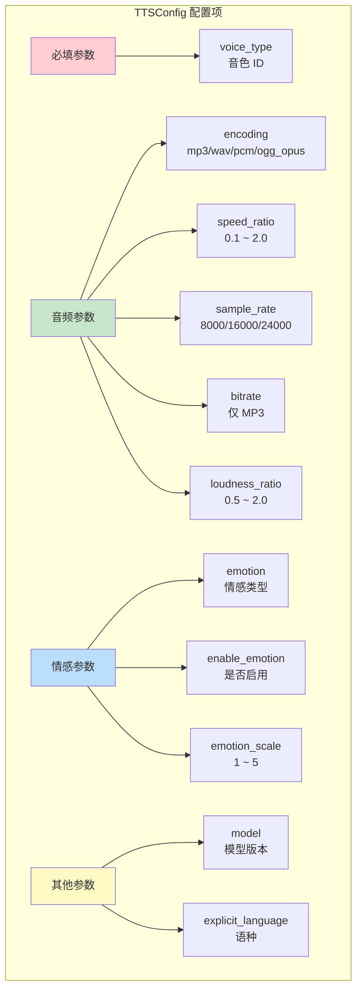

---

### 11.7 豆包 TTS 服务文件结构

```
backend/doubao_tts_v2/
├── __init__.py          # 模块入口，导出所有组件
├── config.py            # 配置项（APP_ID, ACCESS_TOKEN 等）
├── models.py            # 数据模型（TTSConfig, TTSResult, VoicePresets）
├── service.py           # DoubaoTTSService 核心服务（V3 API 封装）
├── tts_db_models.py     # 数据库模型（SQLAlchemy）
├── tts_api_models.py    # API 请求/响应模型（Pydantic）
├── tts_router.py        # FastAPI 路由器
├── example.py           # 使用示例
└── test_tts.py          # 测试脚本
```

---

### 11.8 使用示例

```python
from backend.doubao_tts_v2 import DoubaoTTSService, TTSConfig, VoicePresets

# 创建服务实例
tts = DoubaoTTSService(
    app_id="your_app_id",
    access_token="your_access_token",
    resource_id="seed-tts-2.0",  # 使用 2.0 模型
)

# 配置音色和参数
config = TTSConfig(
    voice_type=VoicePresets.VIVI_2,  # Vivi 2.0 女声
    encoding="mp3",
    speed_ratio=1.0,
    loudness_ratio=1.0,
)

# 同步合成
result = tts.synthesize(
    text="你好，我是豆包语音助手。",
    config=config,
    output_path="output.mp3",
)

if result.success:
    print(f"合成成功: {result.audio_path}")
else:
    print(f"合成失败: {result.error_message}")
```
